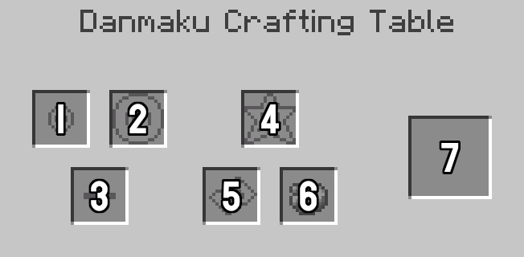
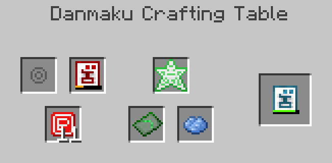

# Danmaku

## Introduction

Danmaku (弾幕, "barrage", lit. "bullet curtain"), also known as Bullet Hell, is a sub-genre of shoot 'em up video games featuring complex patterns of dozens to hundreds of enemy bullets. The Touhou Project games are a well-known example of this genre.

In the context of Arcadian Dream, danmaku is a system that allows you to create bullet patterns and use them in combat. Naturally, there are also enemies that use danmaku against you. In a sense, danmaku is this mod's equivalent of magic.

## Getting Started

To begin creating your own danmaku, you will need a few materials. The main source of these materials are the various enemies in the mod.

!!! note

    Which material does what can be modified using tags.

Icon | Material | Description
-----|----------|------------
 | Power Item | Used to increase the power of bullets.
 | Big Power Item | Used to increase the amount of bullets in a single shot. Also used to create the initial Shot item.
 | Point Item | Used to increase the speed of bullets.
 | Max Point Item | Has no use currently.
 | Star Item | Used to increase the duration of bullets. Also used to create Bullet Cores.
 | Faith Item | Used to repair Shot items.
 | Time Orb | Permanently halves the cooldown of a shot.
 | Enchanted Ice | Makes a shot apply freezing on hit.

The first step is to create a Bullet Core. Each bullet type has an equivalent Bullet Core. These can be crafted using Star Items in a regular crafting table.

!!! note

    Each bullet type has its own base and max stats.

Icon | Bullet Type | Notes
-----|-------------|-----------
 | Circle |
 | Bubble | Has a quite large hitbox.
 | Amulet | Deals more damage to undead mobs.
 | Star | Ignores armor.
 | Kunai | Pierces through enemies.
 | Pellet | Has high max density.

To turn a core into a usable Shot, you will need a Danmaku Crafting Table.

## Danmaku Crafting Table

The Danmaku Crafting Table is a block that allows you to create, repair and modify Shot items.

1. Core
2. Shot
3. Modifier
4. Repair
5. Pattern
6. Color
7. Result

Placing a core in the core slot and a Big Power Item in the modifier slot will result in a Shot item. From there you can place it in the shot slot to repair it using Faith Items in a repair slot or modifying it using other materials and slots.

<figure markdown>
  {width="326"}
  <figcaption>An example of crafting a shot.</figcaption>
</figure>

<figure markdown>
  {width="326"}
  <figcaption>An example of modifying and repairing a shot.</figcaption>
</figure>

## Using Danmaku

After getting your hands on a Shot, you can use it like any other throwable projectile. Keep in mind that the shot's density affects the durability. Shots cannot break, only become unusable until repaired.

There is also a cooldown between shots. Modifying a shot in any way will increase the cooldown, up to a maximum based on the bullet type.

Bullets deal their own type of damage, so they are not affected by things like Projectile Protection. There is a new enchantment called Danmaku Protection that can be applied to armor to reduce the damage taken from bullets.

## Patterns

By default, shots come with the "spread" pattern. This pattern will fire a single bullet in the direction you are looking. If there are multiple bullets in a single shot, they will have divergence applied to them based on the density.

More patterns can be found around the Minecraft world in the form of templates. Once found, a Pattern Template can be crafted into a Bullet Pattern item, which can then be placed in the pattern slot of a Danmaku Crafting Table.

Pattern items can be duplicated using an existing pattern, some materials and a shot.

Icon | Pattern | Location
-----|---------|---------
 | Spread | Shipwreck
 | Ray | Pillager Outpost
 | Ring | Nether Fortress & Abandoned Shrine
 | Arc | Ancient City
 | Double | Mineshaft
 | Triple | Stronghold

## Cancelling Bullets and Extends

Icon | Item
-----|-----
 | Bomb Item
 | Extend Item
 | Life Fragment

Bullets that are not your own can be cancelled using a Bomb Item. This removes all nearby bullets and gives you some Star Items in return. Bombs are quite uncommon, so use them wisely.

There is also the Extend Item, which acts as an equipable Totem of Undying. It will cancel bullets similar to a Bomb, but won't give you any Star Items. It also grants temporary invulnerability. It is a rare drop from certain mobs.

Extends can be turned into Life Fragments and vice versa.
