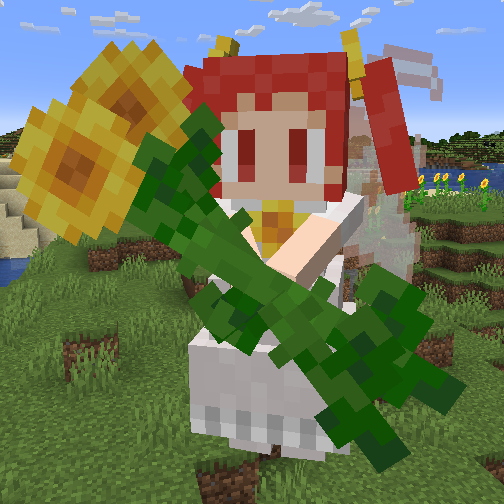
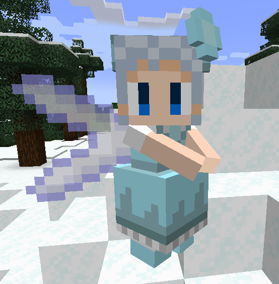

# Mobs

Arcadian Dream is going to feature many familiar mobs from the Touhou universe. This page lists all of the mobs that are currently in the mod, as well as their drops and spawn conditions.

## Monsters

**WIP**

### Fairies

Fairies are the most common type of mob in Arcadian Dream. They come in many[^1] different types, and spawn in many different biomes. They are also generally the weakest mobs in the mod, and are easy to defeat.

[^1]: soon™

!!! note "Needs more work"

    The formatting could be better.

<table style="width: 100%">
    <tr>
        <th>Image</th>
        <th>Name</th>
        <th>Spawn Conditions</th>
        <th>Nature</th>
        <th>Drops</th>
    </tr>
    <tr>
        <td></td>
        <td>Fairy</td>
        <td>In temperate biomes in the Overworld, during the day.</td>
        <td>Neutral (defends Sunflower Fairies)</td>
        <td>
            
Common Drops

            <ul>
                <li>0-5 Power Items  (0-6 with Looting)</li>
                <li>0-5 Point Items  (0-6 with Looting)</li>
                <li>0-5 Star Items  (0-6 with Looting)</li>
            </ul>
            
Rare Drops

            <ul>
                <li>1% chance of a Bomb Item  (increases to 2.5% with Looting III)</li>
                <li>0.4% chance of an Extend Item  (increases to 1.9% with Looting III)</li>
                <li>0.1% chance of a Music Disc  (increases to 0.4% with Looting III)</li>
            </ul>
        </td>
    </tr>
    <tr>
        <td></td>
        <td>Sunflower Fairy</td>
        <td>Same as Fairy but more common in Sunflower Plains.</td>
        <td>Hostile</td>
        <td>
            
Common Drops

            <ul>
                <li>2-7 Power Items  (2-8 with Looting)</li>
                <li>2-7 Point Items  (2-8 with Looting)</li>
                <li>2-7 Star Items  (2-8 with Looting)</li>
            </ul>
            
Rare Drops

            <ul>
                <li>5% chance of a Bomb Item  (increases to 9.5% with Looting III)</li>
                <li>0.1% chance of an Extend Item  (increases to 0.4% with Looting III)</li>
                <li>0.3% chance of a Music Disc  (increases to 1.2% with Looting III)</li>
            </ul>
        </td>
    </tr>
    <tr>
        <td></td>
        <td>Ice Fairy</td>
        <td>In snowy and icy biomes in the Overworld, during the day.</td>
        <td>Neutral (defends Sunflower Fairies)</td>
        <td>
            
Common Drops

            <ul>
                <li>0-5 Power Items  (0-6 with Looting)</li>
                <li>0-5 Point Items  (0-6 with Looting)</li>
                <li>0-5 Star Items  (0-6 with Looting)</li>
            </ul>
            
May drop one of the following:

            <ul>
                <li>0-1 Blue Ice  (0-2 with Looting)</li>
                <li>0-2 Packed Ice  (0-3 with Looting)</li>
                <li>0-3 Ice  (0-4 with Looting)</li>
                <li>1 Enchanted Ice</li>
            </ul>
            
Rare Drops

            <ul>
                <li>2% chance of a Bomb Item (increases to 4.1% with Looting III)</li>
                <li>0.6% chance of an Extend Item (increases to 7.8% with Looting III)</li>
                <li>0.2% chance of a Music Disc (increases to 0.8% with Looting III)</li>
            </ul>
        </td>
    </tr>
</table>